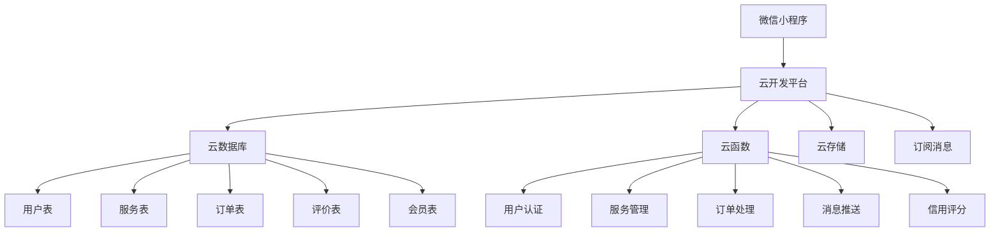

# 社区服务小程序技术方案设计

## 架构概述

采用微信小程序 + 云开发的技术架构，实现前后端一体化开发，提供完整的社区服务解决方案。

## 技术栈

### 前端技术栈
- **框架**: 微信小程序原生框架
- **UI组件**: 自定义组件 + WeUI
- **状态管理**: 小程序全局数据 + 页面数据
- **样式**: WXSS + 温馨社区风格设计

### 后端技术栈
- **云开发平台**: 腾讯云开发 CloudBase
- **数据库**: 云数据库（MongoDB风格）
- **云函数**: Node.js 18.15
- **云存储**: 文件存储服务
- **消息推送**: 订阅消息

## 系统架构图



## 数据库设计

### 用户表 (users)
```javascript
{
  _id: "用户ID",
  openid: "微信openid",
  unionid: "微信unionid",
  nickName: "用户昵称",
  avatarUrl: "头像URL",
  phone: "手机号",
  location: {
    latitude: "纬度",
    longitude: "经度",
    address: "地址"
  },
  creditScore: "信用分数",
  memberLevel: "会员等级",
  memberExpireTime: "会员到期时间",
  createTime: "创建时间",
  updateTime: "更新时间"
}
```

### 服务表 (services)
```javascript
{
  _id: "服务ID",
  userId: "发布者ID",
  type: "服务类型", // 生活服务、跑腿、二手、宠物、互助
  category: "具体分类",
  title: "服务标题",
  description: "服务描述",
  price: "价格",
  images: ["图片URL数组"],
  contactInfo: {
    phone: "联系电话",
    wechat: "微信号"
  },
  location: {
    latitude: "纬度",
    longitude: "经度",
    address: "地址"
  },
  status: "状态", // 发布中、已接单、已完成、已取消
  tags: ["标签数组"],
  createTime: "创建时间",
  updateTime: "更新时间"
}
```

### 订单表 (orders)
```javascript
{
  _id: "订单ID",
  serviceId: "服务ID",
  publisherId: "发布者ID",
  receiverId: "接单者ID",
  status: "订单状态", // 待接单、进行中、已完成、已取消
  price: "订单金额",
  description: "订单描述",
  contactInfo: {
    phone: "联系电话",
    wechat: "微信号"
  },
  location: {
    latitude: "纬度",
    longitude: "经度",
    address: "地址"
  },
  timeline: [{
    status: "状态",
    time: "时间",
    description: "描述"
  }],
  createTime: "创建时间",
  updateTime: "更新时间"
}
```

### 评价表 (reviews)
```javascript
{
  _id: "评价ID",
  orderId: "订单ID",
  reviewerId: "评价者ID",
  reviewedId: "被评价者ID",
  serviceId: "服务ID",
  rating: "评分", // 1-5星
  content: "评价内容",
  images: ["图片URL数组"],
  createTime: "创建时间"
}
```

### 会员表 (members)
```javascript
{
  _id: "会员ID",
  userId: "用户ID",
  level: "会员等级", // 普通、银卡、金卡、钻石
  benefits: ["权益数组"],
  expireTime: "到期时间",
  createTime: "创建时间"
}
```

## 云函数设计

### 1. 用户认证云函数 (auth)
- 微信授权登录
- 获取用户信息
- 更新用户资料

### 2. 服务管理云函数 (service)
- 发布服务
- 查询服务列表
- 更新服务状态
- 删除服务

### 3. 订单管理云函数 (order)
- 创建订单
- 接单处理
- 订单状态更新
- 订单查询

### 4. 评价管理云函数 (review)
- 提交评价
- 查询评价
- 计算信用分数

### 5. 消息推送云函数 (message)
- 发送订阅消息
- 订单状态通知
- 服务匹配通知

### 6. 会员管理云函数 (member)
- 会员注册
- 会员权益查询
- 会员等级升级

## 页面结构设计

### 主要页面
1. **首页** (pages/index/index)
   - 社区定位
   - 分类入口
   - Banner轮播
   - 推荐服务

2. **生活服务** (pages/life-service/index)
   - 服务分类
   - 服务列表
   - 服务详情
   - 发布服务

3. **跑腿代办** (pages/errand/index)
   - 任务列表
   - 任务详情
   - 发布任务
   - 接单管理

4. **二手闲置** (pages/second-hand/index)
   - 物品分类
   - 物品列表
   - 物品详情
   - 发布物品

5. **宠物服务** (pages/pet-service/index)
   - 服务类型
   - 服务列表
   - 服务详情
   - 发布服务

6. **好邻居互助** (pages/neighbor-help/index)
   - 互助请求
   - 请求列表
   - 请求详情
   - 发布请求

7. **个人中心** (pages/profile/index)
   - 用户信息
   - 我的服务
   - 我的订单
   - 会员中心

8. **订单管理** (pages/order/index)
   - 订单列表
   - 订单详情
   - 订单状态

## 安全设计

### 权限控制
- 基于openid的用户身份验证
- 数据库权限规则设置
- 云函数权限验证

### 数据安全
- 敏感信息加密存储
- 图片上传安全检查
- 防SQL注入

### 业务安全
- 订单状态验证
- 用户信用评分机制
- 恶意行为检测

## 性能优化

### 前端优化
- 图片懒加载
- 分页加载
- 缓存策略

### 后端优化
- 数据库索引优化
- 云函数冷启动优化
- CDN加速

## 测试策略

### 单元测试
- 云函数逻辑测试
- 数据库操作测试

### 集成测试
- 页面功能测试
- 用户流程测试

### 性能测试
- 并发用户测试
- 响应时间测试

## 部署方案

### 开发环境
- 本地开发工具
- 云开发测试环境

### 生产环境
- 云开发生产环境
- 自动部署流程
- 监控告警机制 